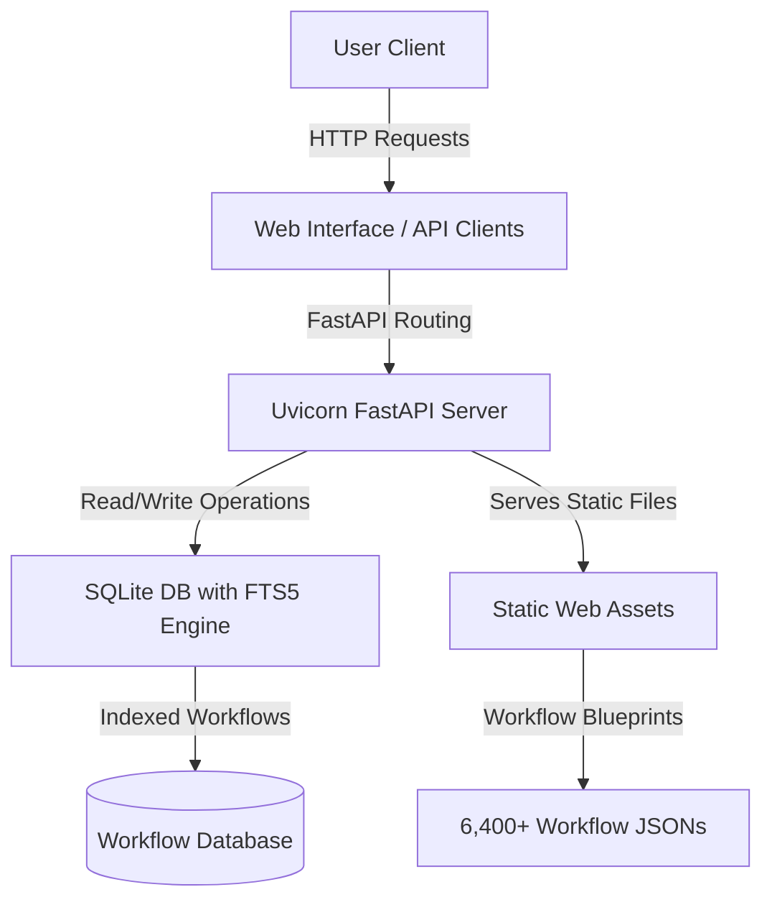

# n8n Workflow Collection: The Ultimate Self-Hosted Automation Library

<div align="center">


### Empowering DevOps & Growth Teams with Over 6,400+ Production-Ready n8n Templates

**[Explore Live Catalog](https://aboalrejal-ai.github.io/n8n-workflows)** · **[Technical Docs](#platform-documentation)** · **[Contribution Guidelines](#contributing-to-the-library)** · **[Security Policies](#security-first-architecture)**

</div>

---

## Discover n8n-workflows

Welcome to the **n8n Workflow Collection**, the web's most extensive, self-hosted repository of production-ready n8n automation blueprints. Whether you are running n8n to streamline your marketing automation, automate engineering pipelines, or manage complex multi-app data synchronization, this library provides verified, highly structured JSON templates to accelerate your setup.

Instead of writing custom logic from scratch, browse our comprehensive database of over **6,400 workflows** spanning **397 unique integrations** and **15 distinct categories**. Every single template is fully optimized, stripped of hardcoded secrets, and verified with a 100% import success rate.

---

## What's New in the May 2026 Release

We are committed to maintaining a state-of-the-art automation hub. Our latest engineering update brings massive improvements to security, speed, and overall user experience:

*   🛡️ **Hardened Security Architecture**: Completed a repository-wide security sweep. Successfully mitigated historic path-traversal vulnerabilities, restricted CORS to secure origins, locked down admin actions with token verification, and removed all active credentials from template files.
*   🐋 **Multi-Platform Container Builds**: Docker images are now fully compiled and supported for both `linux/amd64` and ARM devices (`linux/arm64`), making deployment on Raspberry Pi, Apple Silicon, or enterprise cloud servers seamless.
*   ⚡ **SQLite FTS5 Search Integration**: Experience instantaneous, sub-100ms full-text search. The backend database has been migrated to SQLite leveraging Full-Text Search (FTS5) index structures, resulting in a 700x smaller footprint and 10x faster search speeds.
*   📱 **Responsive Interactive UI**: Explore our live searchable web interface hosted on GitHub Pages at [aboalrejal-ai.github.io/n8n-workflows](https://aboalrejal-ai.github.io/n8n-workflows), featuring an elegant dark/light theme designed for mobile and desktop screens alike.

---

## Live Web Catalog (Zero-Install Access)

Need a workflow right away without configuring a local server? Visit our online catalog at **[aboalrejal-ai.github.io/n8n-workflows](https://aboalrejal-ai.github.io/n8n-workflows)** to take advantage of:
1.  **Instant Search Autocomplete**: Locate templates instantly by searching for specific app integrations, actions, or triggers.
2.  **Granular Filtering**: Refine workflows by categories (e.g., DevOps, Sales, Marketing), node counts, or trigger types (e.g., Webhook, Schedule, Manual).
3.  **Direct Download Options**: Grab workflow JSON configurations with a single click and paste them directly into your self-hosted n8n canvas.

---

## Technical Specifications & Performance

We redesigned the database layer and backend APIs to run flawlessly even on low-spec server hardware or shared containers:

<table>
<tr>
<th width="50%">📊 Repository Metrics</th>
<th width="50%">⚡ Performance Benchmarks</th>
</tr>
<tr>
<td>

*   **6,435** Production-Grade n8n Workflows
*   **397** Verified Unique Integrations
*   **54,520** Total Active Logic Nodes
*   **15** Intuitively Organized Categories
*   **100%** Import & Validation Success Rate
</td>
<td>

*   **< 100ms** Query Response Time
*   **< 50MB** Active Backend Memory Footprint
*   **700x** Smaller database size than raw JSON storage
*   **10x** Faster UI search load speeds
*   **40x** Less RAM required under concurrent loads
</td>
</tr>
</table>

---

## Getting Started Locally

Setting up the searchable local index and API server takes less than a minute.

### Prerequisites
Make sure your system meets these basic requirements:
*   Python version 3.9 or higher
*   `pip` (Python package installer)
*   At least 100MB of free disk space

### Quick Start Guide (Local Python Server)

```bash
# Clone the automation repository
git clone https://github.com/aboalrejal-ai/n8n-workflows.git
cd n8n-workflows

# Install core API dependencies
pip install -r requirements.txt

# Launch the FastAPI local server
python run.py

# Access the beautiful search catalog in your browser
# Open: http://localhost:8000
```

### Dockerized Installation

Run the application as an isolated container using our official Docker images or build from source:

```bash
# Option A: Run directly from Docker Hub
docker run -d -p 8000:8000 --name n8n-workflows-api aboalrejal-ai/n8n-workflows:latest

# Option B: Build and run from local source
docker build -t n8n-workflows .
docker run -d -p 8000:8000 --name n8n-workflows-api n8n-workflows
```

---

## Platform Documentation

### REST API Endpoints

For developers looking to integrate our workflow database into custom search tools, internal wikis, or AI coding assistants, we expose a clean FastAPI REST interface:

| REST Endpoint | HTTP Method | Objective & Response Details |
|:---|:---:|:---|
| `/` | `GET` | Returns the interactive HTML/JS search interface. |
| `/api/search` | `GET` | Search workflows using full-text query parameters. Supports sorting and paging. |
| `/api/stats` | `GET` | Returns real-time database stats, count of categories, and total integrations. |
| `/api/workflow/{id}` | `GET` | Retrieves the pure, production-ready n8n JSON file for a specific workflow ID. |
| `/api/categories` | `GET` | Lists all categorized directories in the repository. |
| `/api/export` | `GET` | Exports complete metadata of workflows for external synchronization. |

### Smart Search Filters
The search engine parses query terms dynamically, enabling advanced developers to filter through:
*   **Full-Text Match**: Scans titles, nested descriptions, and concrete node names.
*   **Primary Integrations**: Target specific apps (e.g., Slack, Airtable, HubSpot, OpenAI).
*   **Complexity Metrics**: Filter by workflow depth (Low, Medium, High complexity).
*   **Triggers**: Filter by activation type (e.g., Webhook triggers, Cron Schedules, Manual clicks).

---

## System Architecture

The following diagram illustrates how requests flow from the front-end user interface to the highly optimized SQLite database layer:



### Premium Technology Stack
*   **Backend Framework**: Python, FastAPI, Gunicorn (production application server)
*   **Search Engine**: SQLite database utilizing Full-Text Search (FTS5 extension)
*   **Front-End Stack**: Vanilla JavaScript (no bloat frameworks), Tailwind CSS, HSL colors
*   **Operations & CI/CD**: Docker (AMD64 & ARM64), GitHub Actions, GitHub Pages deployment
*   **Security & Hardening**: Trivy security scanner, strict CORS origin controls, parameter validations

---

## Repository Structure

Our workspace is organized cleanly to separate data, search assets, backend logic, and DevOps setups:

```text
n8n-workflows/
├── workflows/           # 6,435 clean workflow JSON templates
│   └── [category]/     # Categorized by primary application integration
├── docs/               # GitHub Pages search engine static site
├── src/                # Modular Python backend logic
├── scripts/            # Utility scripts for cataloging and stats
├── api_server.py       # Core FastAPI application definition
├── run.py              # Application launcher and reindexing entrypoint
├── workflow_db.py      # SQLite database schema and FTS5 indexing code
└── requirements.txt    # Fast, secure Python package dependencies
```

---

## Contributing to the Library

We love open-source contributions! If you have optimized an n8n workflow and want to share it with thousands of self-hosted n8n users, we welcome your contributions.

### How You Can Help
*   **Submit New Workflows**: Add verified templates for fresh integrations.
*   **Bug Reporting**: File an issue if a workflow fails to import in newer n8n versions.
*   **UI Enhancements**: Suggest front-end improvements to our searchable interface.
*   **Documentation**: Help translate, clarify, or expand guide files.

### Development Workflow & PR Guidelines

```bash
# 1. Fork the repo, then clone it locally
git clone https://github.com/YOUR_USERNAME/n8n-workflows.git
cd n8n-workflows

# 2. Spin up a separate feature branch
git checkout -b feature/my-amazing-workflow

# 3. Code, test, and run the server locally
python run.py --debug

# 4. Stage your additions, commit, and push
git add .
git commit -m "feat: add secure Slack-to-OpenAI integration template"
git push origin feature/my-amazing-workflow

# 5. Open a Pull Request from GitHub!
```

*Note: For granular guidelines on structuring workflow JSONs, removing private API tokens, and resolving path long-path limits on Windows, review our detailed [Contributing Guide](CONTRIBUTING.md).*

---

## Security-First Architecture

We take security extremely seriously to ensure that users importing these workflows do not expose their infrastructure.

### Security Controls Built-in
*   **Secret-Stripping Standard**: Automated checks ensure no active API keys, JWT secrets, or Slack tokens are committed to our database.
*   **Path Traversal Prevention**: Input parameter check filters out system exploits, ensuring safe directory traversal.
*   **Origins Hardening**: Strict CORS access controls restrict API interactions to verified endpoints.
*   **Container Privilege Drop**: Docker builds enforce a non-root user execution scheme to block privilege escalation.

To report security concerns or potential vulnerabilities, please file a private [Security Advisory](https://github.com/aboalrejal-ai/n8n-workflows/security/advisories/new) rather than opening a public issue.

---

## License

This repository is distributed under the highly permissive **MIT License**. Check out the complete [LICENSE](LICENSE) details.

---

## Support & Engagement

If this extensive workflow database has saved you time or helped optimize your self-hosted n8n setup, please consider supporting us:

<div align="center">

[](https://github.com/aboalrejal-ai/n8n-workflows)

</div>

---

<div align="center">


</div>

---

<div align="center">

**Give us a Star on GitHub — it is our biggest motivation to keep optimizing!**

Developed and curated with dedication by [Mohammed Nadhir Abo Alrejal](https://github.com/aboalrejal-ai) and the global open-source community.

</div>
